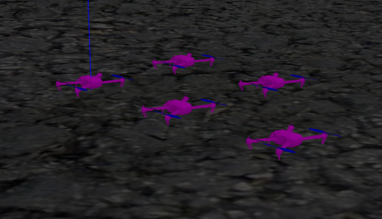
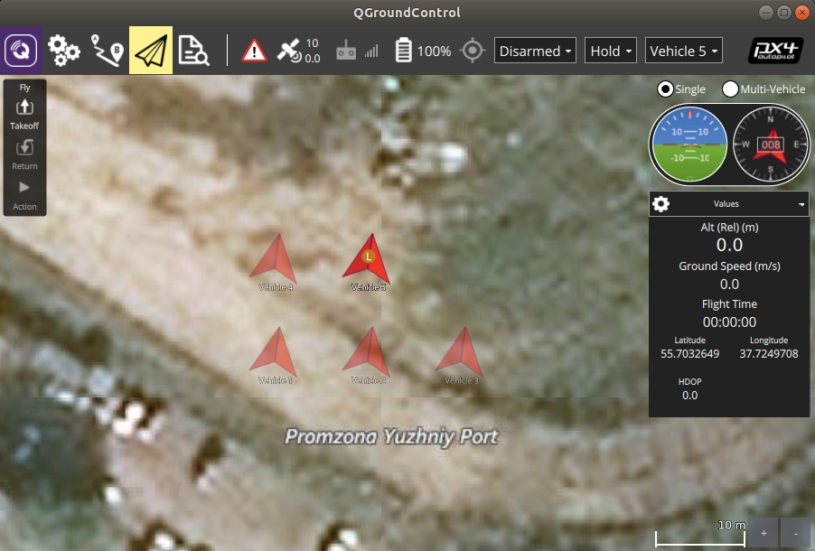
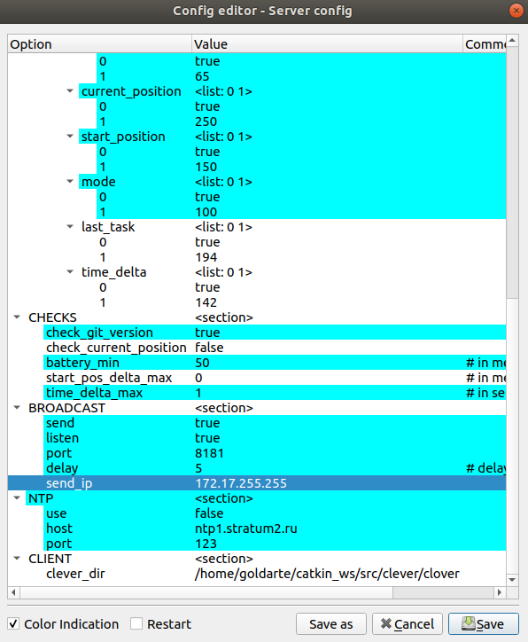
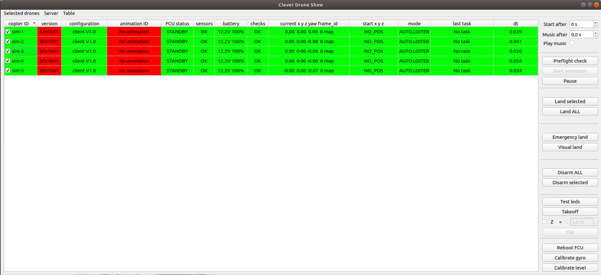
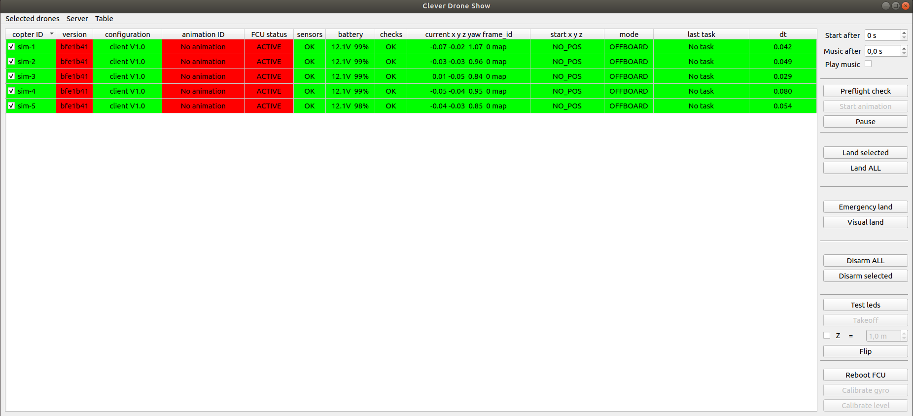
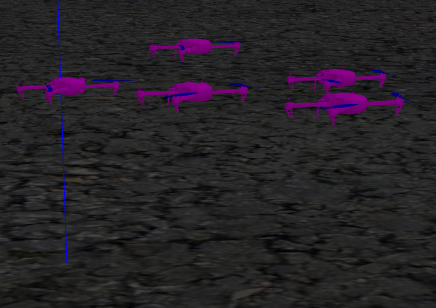

# clever-show-ds

Software kit for multiple Clover drones simulation. Each simulated drone contains roscore, clever, sitl and clever-show services running inside.

You can choose [jMAVSim](https://dev.px4.io/v1.8.2/en/simulation/jmavsim.html) or [Gazebo](https://dev.px4.io/v1.8.2/en/simulation/gazebo.html) as a simulator and generate as many drones in a group as you want (as long as there is enough performance).

Each drone is simulated as docker container and includes:

* [px4 toolchain for simulation](https://dev.px4.io/v1.9.0/en/setup/dev_env.html)
* px4 sitl binary with version [v1.8.2-clever.10](https://github.com/CopterExpress/Firmware/releases/tag/v1.8.2-clever.10)
* [ROS Melodic](http://wiki.ros.org/melodic)
* [jMAVSim](https://github.com/PX4/jMAVSim) lightweight simulator
* [clover](https://github.com/CopterExpress/clever) ROS package
* [clever-show](https://github.com/CopterExpress/clever-show) software
* [roscore](https://github.com/goldarte/clover-ds/tree/master/services/roscore.service) service
* [clover](https://github.com/goldarte/clover-ds/tree/master/services/clover.service) service
* [sitl](https://github.com/goldarte/clover-ds/tree/master/services/sitl.service) service
* [clever-show](services/clever-show.service) service
* [jmavsim](https://github.com/goldarte/clover-ds/tree/master/services/jmavsim.service) service

## Requirements

### Simulate copters with jMAVSim

* Ubuntu 18.04
* docker ([install instruction](https://docs.docker.com/get-docker/))

### Simulate copters in Gazebo

* Ubuntu 18.04
* ROS Melodic Desktop-Full Install ([install instruction](http://wiki.ros.org/melodic/Installation/Ubuntu))
* docker ([install instruction](https://docs.docker.com/get-docker/))

## Prepare

Clone this repository, cd into it and pull docker image:

```cmd
git clone https://github.com/CopterExpress/clever-show-ds.git
cd <cloned repo>
docker pull goldarte/clever-show-ds
```

## Simulate multiple copters with jMAVSim

Launch 5 px4 copters with simulated companion computers and simulation data inside:

```cmd
python simulate.py -n 5 --headless
```

In this case there will be no visualization of copters because each simulated copter has its own lightweight simulator inside. Also, generated copters won't know anything about their collisions because each copter has its own simulated world inside.

You can visualize telemetry data of generated copters on the map in [QGroundControl](#manage-copters-from-qgroundcontrol).

## Simulate multiple copters in Gazebo

Launch Gazebo simulator with empty world and generate 5 px4 copters with simulated companion computers:

```cmd
python simulate.py -n 5
```



> If you get message:
>
> ```cmd
> You don't have roslaunch module! Please, check your ROS installation.
> ```
>
> check that you have ROS installed and add `source /opt/ros/melodic/setup.bash` to the end of ~/.bashrc file.

## Configure

You can configure simulation script:

```cmd
python simulate.py [-h] [-n NUMBER] [-p PORT] [-d DIST] [--headless]

Simulate multiple Clover copters

optional arguments:
  -h, --help            show this help message and exit
  -n NUMBER, --number NUMBER
                        Number of copters to simulate. Default is 1.
  -p PORT, --port PORT  UDP port for simulation data of the first copter.
                        Default is 14601. UDP port for n-th copter will be
                        equal to <port> + n - 1. This parameter is used only
                        in non headless mode.
  -d DIST, --dist DIST  Distance between generated copters in meters. Default
                        is 1. The generated copters will be arranged as a 2D
                        array along East and North axes in a shape close to
                        square.
  --headless            Set this option to run internal lightweight simulation.
```

## Manage copters from QGroundControl

All telemetry from copters is passed to 14550 UDP port. You can run QGroundControl with default settings and see the telemetry from all generated copters:



> To differentiate copters in QGroundControl visualization, you should increase distance between them because of enormous size of the position arrow:
>
> ```cmd
> python simulate.py -n 5 -d 10 --headless
> ```

## Simulate drone show

You can control generated copters from [clever-show](https://github.com/CopterExpress/clever-show) server and simulate the drone show with it.

Clone [clever-show](https://github.com/CopterExpress/clever-show) repository and cd to it

```cmd
git clone https://github.com/CopterExpress/clever-show.git
cd <cloned repo>
```

Setup requirements with pip3

```cmd
pip3 install -r requirements.txt
```

Run clever-show server GUI

```cmd
cd Server
python3 server_qt.py
```

Change option `send_ip` in `BROADCAST` section to `172.17.255.255` by clicking `Server` -> `Edit server config`



Check option `Restart` and click `Save` button.

Wait until all simulated copters connect to server automatically.



Test copters by selecting them all (ctrl+A) and clicking `Takeoff` button on the right panel of GUI.





Land copters by clicking `Land ALL` button on the right panel of GUI.

More documentation about [clever-show](https://github.com/CopterExpress/clever-show#documentation) software can be found in the Github repository.

## Run container standalone

Use `run` script to run container standalone. You can specify next options:

```cmd
./run [options]

Options:
  -h --help         Print this message
  -i --id=ID        ID of simulated copter. Used as MAV_SYS_ID.
                    Container name and hostname are set to sim-<ID> (default: 1)
  -p --port=PORT    Initial UDP port (default: 14560)
                    UDP listening port for simulator data is set to <PORT>+<ID>
  --headless        Set this option to run lightweight jmavsim simulator directly in container
  --lat=LATITUDE    Set initial latitude
  --lon=LONGITUDE   Set initial longitude
  --dx=DX           Set dx shift in meters to East (default: 0)
  --dy=DY           Set dy shift in meters to North (default: 0)
See defaults for initial latitude and longitude here:
https://github.com/goldarte/clover-ds/blob/master/scripts/calculate_gps.py#L7

```

> Each time you want to run new container it must have unique ID and UDP port for simulator data!

There will be 4 services running inside the container: roscore, clover, sitl and clever-show. If you set `--headless` option, there will be running jmavsim service also.

You can manage running services inside the container using `systemctl` and watch their logs with `journalctl -u <service name>`. For example if you want to restart the service `clover`, just use `systemctl restart clover`.

If you want to open new terminal session in working container, use following command:

```cmd
docker exec -it <container name> bash
```

To stop or kill containers you can use

```cmd
docker stop <container name>
docker kill <container name>
```

To get information about running containers you can use

```cmd
docker ps
```
